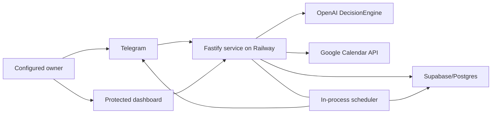

# ADR — Architecture for product slice 1, A Promise That Fits

Status: accepted

Scope: [`scope.md`](./scope.md)

Parent contract: [`../../product.md`](../../product.md)

## Context

The completed infrastructure spike established a React/Vite browser application, Fastify API, Docker packaging, automated API and browser tests, and a public Railway deployment. It intentionally excluded Telegram, persistence, scheduling, model behavior, authentication, and Google Calendar.

The first product slice must now introduce those capabilities without turning into a collection of disconnected platform layers. The architecture must support one complete experience:

> A configured owner turns an intention into a confirmed one-off commitment, finds realistic time around read-only Calendar constraints, receives durable reminders and check-ins, records what happened, and sees the same live state on a protected dashboard.

The design optimizes for:

- One owner rather than general multi-tenancy.
- Explicit confirmation before consequential state changes.
- Deterministic business rules around a bounded language-model decision core.
- Durable, inspectable state.
- Minimal exposure and retention of Calendar and conversation data.
- One deployable service and one source of truth.
- Honest failure and delivery semantics.

## Decision summary

Shiori will remain one Fastify service deployed on Railway. Fastify serves the React build, Telegram webhook, owner API, Google OAuth callback, and an in-process scheduler. Supabase/Postgres is the durable source of truth.

OpenAI is the initial language-model provider behind a replaceable `DecisionEngine` adapter. The model returns strict structured output for classification and extraction. It does not receive Calendar event details and cannot directly execute product tools. Application services deterministically own authorization, draft transitions, Calendar access, availability calculation, persistence, scheduling, callback validation, and outcome recording.

Telegram inline buttons carry opaque, versioned action references. Work is scheduled durably in Postgres and claimed transactionally. Delivery is idempotent inside Shiori, with an at-most-once bias when Telegram's external delivery result is ambiguous.

Google Calendar access is read-only, primary-Calendar-only, and connected through the owner dashboard. The refresh token is encrypted in Supabase with a key held in Railway secrets. Google OAuth remains in Testing, so seven-day token expiry and dashboard reconnection are accepted limitations.

## System context



## Decision 1: one backend and server-owned data access

### Decision

Fastify is the sole application boundary:

- The browser calls Fastify owner APIs.
- Telegram calls the Fastify webhook.
- Fastify calls OpenAI, Google Calendar, Telegram delivery APIs, and Supabase.
- The browser does not receive Supabase credentials or access Supabase directly.
- The Telegram layer does not bypass application services.

### Rationale

One backend preserves the deployment foundation proved by the spike, centralizes owner authorization and invariants, and prevents browser-visible access to persistence or OAuth secrets.

### Consequences

- Server APIs must exist for all dashboard reads and Google connection actions.
- Supabase Row Level Security should deny unintended direct client access even though the server uses privileged credentials.
- The Fastify service is security-sensitive and must validate every external boundary.

## Decision 2: bounded OpenAI decision engine

### Decision

Create a provider-neutral `DecisionEngine` interface with an OpenAI implementation. Configure the model identifier and prompt version through the environment or an application configuration module.

Use the OpenAI Responses API with strict Structured Outputs for actionable turns. Define the schema in TypeScript using the same source used for runtime validation, avoiding drift between application types and the API schema.

The decision engine may:

- Classify explicit requests, implied intentions, and ordinary questions.
- Extract commitment fields and corrections.
- Identify missing information.
- Decide whether to offer help finding work time.
- Produce ordinary-question answers and conversational response ingredients.

It may not:

- Authenticate an owner.
- Interpret Telegram callback authority.
- Query Calendar.
- Calculate free windows.
- Confirm or persist a commitment.
- Schedule or send reminders.
- Mark a commitment done or cancelled.
- Choose or execute arbitrary tools.

### Rationale

Structured output makes the language boundary inspectable and typed, while deterministic orchestration prevents a plausible model response from becoming authorization. OpenAI's current guidance distinguishes structured response formats from function calling and recommends Structured Outputs over JSON mode when schema adherence is required. See [OpenAI Structured Outputs](https://developers.openai.com/api/docs/guides/structured-outputs).

### Validation

Application code must still validate semantic invariants, including:

- Target is present and in the configured owner time zone.
- Duration is one of 30, 60, 90, or 120 minutes.
- A simple action and a duration-based work session are not represented simultaneously.
- An implied intention cannot act before permission.
- An ordinary question cannot mutate product state.
- Model refusal, incomplete response, timeout, or schema failure produces no consequential action.

### Rejected alternatives

- **Open-ended agent loop with model-selected tools:** rejected because authorization and state transitions would be harder to bound and test.
- **Plain JSON prompting:** rejected because valid JSON alone does not guarantee schema adherence.
- **Provider logic spread through routes:** rejected because it makes later provider or model changes invasive.

## Decision 3: explicit state machines

### Draft states

```text
collecting
  -> awaiting_permission
  -> awaiting_clarification
  -> awaiting_calendar_choice
  -> awaiting_confirmation
  -> confirmed
  -> cancelled
  -> expired
```

Only one non-terminal draft may exist. Every correction increments its version. Inline callbacks and Calendar suggestions reference that version.

### Commitment states

```text
active -> done
active -> cancelled
active -> overdue -> done
active -> overdue -> cancelled
```

Overdue is derived from an active commitment whose target has passed. The target is immutable in this slice.

### Work-session states

```text
planned
  -> started
  -> awaiting_check_in
  -> done
  -> more_work_needed
  -> missed
  -> cancelled
```

Done closes the parent commitment. More work needed and missed leave it active and may begin a new draft-like scheduling step for one next work session.

Only one future planned work session may exist for an active commitment.

### Scheduled-message states

```text
pending -> claimed -> delivered
pending -> claimed -> delivery_unknown
pending -> claimed -> retryable_failure -> pending
pending -> cancelled
```

Each simple reminder, session-start reminder, and session-end check-in has a unique logical delivery key.

## Decision 4: Postgres as source of truth and coordination point

### Decision

Use Supabase/Postgres for:

- Durable drafts.
- Commitment and work-session state.
- Scheduled-message state.
- Telegram update idempotency.
- Append-only product events.
- Google connection metadata and encrypted refresh token.
- Transactional claims and uniqueness constraints.

Database functions or transactions own multi-row state transitions that must be atomic.

### Candidate logical schema

The final migration may refine names, but must preserve these responsibilities.

#### `telegram_updates`

| Field | Purpose |
|---|---|
| `update_id` | Telegram idempotency key |
| `owner_id` | Configured owner reference |
| `received_at` | Receipt timestamp |
| `status` | Processing state |
| `resolved_action_key` | Optional product transition reference |

The complete webhook payload is not retained.

#### `conversation_drafts`

| Field | Purpose |
|---|---|
| `id` | Opaque draft identifier |
| `owner_id` | Owner |
| `version` | Stale-action protection |
| `state` | Draft state |
| `definition_of_done` | Proposed outcome |
| `target_at` | Proposed immutable target |
| `mode` | Simple action or work session |
| `duration_minutes` | Optional supported duration |
| `timing_constraints` | Structured user constraints |
| `proposed_start_at` | Optional session start |
| `calendar_check_status` | Free, conflict, unavailable, not checked |
| `calendar_checked_at` | Check freshness |
| `pending_question` | Restart-safe conversational state |
| `expires_at` | 24-hour expiry |

Only one active draft is allowed per owner.

#### `model_decisions`

| Field | Purpose |
|---|---|
| `id` | Decision identifier |
| `draft_id` | Optional draft |
| `input_class` | Three-way classification |
| `decision_payload` | Validated structured output |
| `model_id` | Configured provider model |
| `prompt_version` | Decision-contract version |
| `created_at` | Audit timestamp |

Raw chain-of-thought and unrestricted provider traces are not stored.

#### `commitments`

| Field | Purpose |
|---|---|
| `id` | Commitment identifier |
| `owner_id` | Owner |
| `definition_of_done` | Completion contract |
| `target_at` | Immutable target |
| `status` | Active, done, cancelled |
| `created_at` | Creation time |
| `completed_at` | Actual Done time |
| `cancelled_at` | Cancellation time |

#### `work_sessions`

| Field | Purpose |
|---|---|
| `id` | Session identifier |
| `commitment_id` | Parent commitment |
| `sequence` | Historical order |
| `start_at` | Session start |
| `end_at` | Session end |
| `duration_minutes` | 30, 60, 90, or 120 |
| `calendar_check_status` | Check outcome |
| `calendar_checked_at` | Check timestamp |
| `status` | Planned/session result |
| `is_recovery` | Whether session begins after target |

A partial unique constraint prevents more than one future planned session for a commitment.

#### `scheduled_messages`

| Field | Purpose |
|---|---|
| `id` | Message schedule identifier |
| `logical_key` | Unique delivery identity |
| `commitment_id` | Parent commitment |
| `work_session_id` | Optional session |
| `kind` | Simple reminder, session start, session end |
| `due_at` | Delivery time |
| `state` | Delivery state |
| `attempt_count` | Bounded retry tracking |
| `claimed_at` | Worker lease |
| `telegram_message_id` | Present after confirmed delivery |
| `last_error_class` | Redacted failure classification |

#### `commitment_events`

Append-only ledger with:

- Event ID.
- Commitment ID.
- Optional work-session ID.
- Event type.
- Occurred-at timestamp.
- Actor.
- Idempotency key.
- Minimal structured metadata.

Example types:

- `commitment.created`
- `commitment.done`
- `commitment.cancelled`
- `work_session.planned`
- `work_session.started`
- `work_session.more_work_needed`
- `work_session.missed`
- `scheduled_message.delivery_attempted`
- `scheduled_message.delivered`
- `scheduled_message.delivery_unknown`

#### `google_connections`

| Field | Purpose |
|---|---|
| `owner_id` | One owner connection |
| `google_email` | Verified identity |
| `refresh_token_ciphertext` | Encrypted token |
| `refresh_token_nonce` | Authenticated-encryption nonce |
| `refresh_token_tag` | Authentication tag if stored separately |
| `key_version` | Encryption-key rotation metadata |
| `granted_scopes` | Auditable least privilege |
| `status` | Connected, expired, error |
| `connected_at` | Connection time |
| `last_success_at` | Last successful Calendar request |

## Decision 5: Telegram text plus versioned inline actions

### Decision

Use Telegram text for user intentions, clarifications, constraints, and corrections. Use inline buttons for bounded state transitions:

- Confirm and Cancel for drafts.
- Done and Cancel for simple reminders.
- Done for early session completion.
- Done, Need more time, and Missed this session for session-end check-ins.
- Done and Cancel in `/status`.

Callback data contains an opaque action reference and version, not product text or secrets. Every callback is checked against:

- Webhook authenticity.
- Configured numeric Telegram owner ID.
- Private chat.
- Current entity state.
- Current version.
- Unique transition key.

### Rationale

Buttons reduce ambiguity at consequential boundaries and make duplicate handling testable. Free text remains appropriate for language understanding and corrections.

### Consequences

The parent product boundary changes from text-only Telegram updates to text plus Shiori-provided inline buttons. Callback queries become part of the webhook contract and test surface.

## Decision 6: owner boundaries

### Telegram

- One configured numeric Telegram user ID.
- One private chat.
- Telegram webhook secret validation.
- Generic refusal for unauthorized users.

### Dashboard

Use a single-owner password gate:

- Store an Argon2id password hash in Railway secrets.
- Store a separate session-signing secret.
- Issue a short-lived `HttpOnly`, `Secure`, `SameSite=Lax` cookie.
- Rate-limit login attempts.
- Require the session for every dashboard API and Google connection action.
- No registration, password reset, account profile, or multi-user tables.

The dashboard is read-only for commitments. Google Connect/Reconnect is the one configuration mutation exposed there.

## Decision 7: Google OAuth and token protection

### OAuth flow

The dashboard displays connection state and Connect/Reconnect. Those actions start the server-side OAuth flow; Google returns to a Fastify callback.

The implementation must:

- Use a Web Application OAuth client.
- Use the deployed HTTPS callback and an allowed local callback for development.
- Request offline access.
- Validate OAuth state bound to the owner session.
- Request identity scopes needed to verify the configured email.
- Request only the read-only Calendar scopes needed for event fields and availability.
- Verify the returned Google account matches the configured owner email.
- Never expose tokens to browser JavaScript.

### Token storage

- Store client credentials and token-encryption key in Railway secrets.
- Encrypt the refresh token with authenticated encryption, such as AES-256-GCM.
- Store ciphertext, nonce, authentication metadata, scopes, and key version in Supabase.
- Do not log authorization codes, access tokens, refresh tokens, or decrypted credentials.
- Replace the saved token atomically on Reconnect.

### Testing status

The OAuth app remains External and in Google's Testing status. The owner accepts:

- An unverified/test consent experience.
- Calendar refresh-token expiry after approximately seven days.
- Periodic Reconnect through the dashboard.

Calendar disconnection degrades availability assistance but does not block commitment creation, reminders, outcomes, cancellation, or dashboard access.

### Rejected alternatives

- **Local script plus manually copied refresh token:** rejected because dashboard reconnection is a better owner recovery path.
- **Refresh token stored directly as a Railway variable:** rejected because reauthorization cannot replace it through the product without infrastructure mutation.
- **Google OAuth production status or verification:** explicitly outside this slice.
- **Calendar write scopes:** explicitly prohibited.

## Decision 8: deterministic Calendar boundary

### Decision

Create a bounded Calendar adapter and deterministic availability service.

The Calendar adapter may return only:

- Event identifier.
- Title.
- Start and end.
- Time zone.
- Busy/free status.
- Recurrence information.
- Event status.

The availability engine consumes Google FreeBusy results as the authority for blocked intervals and applies the policy in `scope.md`.

Calendar event details are not sent to OpenAI. A controlled application renderer may insert a sanitized conflicting-event title and time into a response without adding unrelated events to model context.

Persist only:

- Checked range.
- Check timestamp.
- Free, conflict, unavailable, or unverified result.
- Chosen work window.

Do not persist complete event objects or titles.

### Rationale

Availability calculation is a deterministic scheduling problem. Keeping it outside the model reduces privacy exposure and prevents invented or misread Calendar state.

## Decision 9: final availability recheck

### Decision

Every work-session confirmation triggers a final Calendar check tied to the current draft version.

- Still free: save.
- Newly conflicting: do not save; explain and offer new choices.
- Owner keeps the conflict: require a new explicit confirmation.
- Calendar unavailable: offer Save without Calendar check.

After saving, do not monitor Calendar changes. Store and display the historical check timestamp.

### Rationale

This closes the most important race without introducing continuous synchronization or a background Calendar-monitoring system.

## Decision 10: database-backed in-process scheduler

### Decision

Run a polling scheduler inside the Fastify Railway process:

1. Query a Postgres function for due work.
2. Atomically claim a bounded batch using leases and row locking.
3. Write the unique delivery-attempt event.
4. Call Telegram.
5. Record delivered, known retryable failure, permanent failure, or unknown.
6. Recover expired claims after a bounded lease period.

Use one Railway application replica in this slice. Database claims and uniqueness constraints remain mandatory so correctness does not depend only on process count.

### Delivery guarantee

Shiori guarantees that its own logical message is scheduled and transitioned once. It cannot guarantee exactly-once external delivery because Telegram does not accept a caller-supplied idempotency key for sending a message.

When an HTTP result is ambiguous after a request may have reached Telegram:

- Mark delivery `unknown`.
- Do not automatically resend.
- Surface the state in dashboard history and operational logs.

Retry only failures known to be safe, such as explicit rate limiting before acceptance. Use a small bounded retry count.

### Rejected alternatives

- **In-memory timers:** lose state across deploys and restarts.
- **Railway cron:** unsuitable for arbitrary one-off timestamps and stateful claims.
- **Redis or external queue:** adds an infrastructure system before it is necessary.
- **Supabase Edge Functions:** splits one product runtime across more deployment surfaces.

## Decision 11: work-session notification model

### Simple action

- One reminder at target.
- Done and Cancel actions.
- No automatic follow-up after non-response.

### Duration-based work session

- One start reminder.
- One end check-in.
- Done may be pressed at the start, end, or from `/status`.
- Completing or cancelling prevents unsent scheduled messages.
- End check-in offers Done, Need more time, and Missed this session.
- Non-response produces no further message.

### Continuation

- Need more time records partial progress without a percentage.
- Missed records that no work occurred.
- The owner decides whether another session is needed.
- One next session is Calendar-checked and confirmed.
- Recovery after the target retains the original target and overdue status.

### Rationale

The work-session boundary gives Calendar-selected time a meaningful follow-through loop while avoiding automatic planning, behavioral inference, or repeated nagging.

## Decision 12: dashboard read model

### Decision

Expose owner-protected Fastify read APIs that derive:

- Active, due-today, and overdue counts.
- Active commitment cards.
- Next session or simple reminder.
- Historical Calendar-check status.
- Scheduled-message delivery status.
- Session outcomes.
- Recent completion and cancellation.
- Short append-only event history.
- Google connection health.

Use request/response refresh with a visible last-updated time. Do not add WebSockets or live subscriptions.

### Rationale

The dashboard validates the single source of truth without becoming a second commitment-management interface.

## Decision 13: data minimization

### Persist

- Telegram update identity and processing result.
- Structured draft state.
- Validated model decisions and version metadata.
- Commitments, work sessions, scheduled messages, and append-only events.
- Minimal Calendar-check metadata.
- Encrypted Google credentials and connection metadata.

### Do not persist

- Complete Telegram webhook payloads.
- Permanent chat transcripts.
- Chain-of-thought.
- Unrestricted OpenAI debug traces.
- Full Calendar responses.
- Calendar event titles in product history.
- Secrets or plaintext refresh tokens.

### Logging

Use structured logs with identifiers and redacted failure classes. Do not log message text, Calendar titles, dashboard passwords, OAuth codes, tokens, cookies, or authorization headers by default.

## Decision 14: verification strategy

### Automated

- Unit-test decision-schema validation with representative fixtures.
- Use a deterministic fake `DecisionEngine` for application and browser tests.
- Test Calendar-slot calculation without external API calls.
- Test state transitions, uniqueness constraints, scheduler claims, callback versions, and authorization boundaries.
- Test Telegram and Google adapters at their HTTP contracts with controlled fixtures.
- Run `npm run check`.

### Deployed smoke

Use the real configured services to record:

- Input.
- Validated structured decision.
- Application action.
- Stored state.
- Telegram response or delivery state.
- Dashboard evidence.

All evidence belongs in [`evidence.md`](./evidence.md), not a product-wide evidence file.

Formal evaluation infrastructure, repeated scoring, trace analysis, and prompt-management platforms are outside the slice.

## API boundary

Exact route names may change during implementation, but these responsibilities must remain explicit.

### Public infrastructure

- `GET /api/health`

### Telegram

- `POST /api/telegram/webhook`

### Owner authentication

- `POST /api/owner/login`
- `POST /api/owner/logout`
- `GET /api/owner/session`

### Dashboard reads

- `GET /api/dashboard/summary`
- `GET /api/commitments`
- `GET /api/commitments/:id`
- `GET /api/google-calendar/connection`

### Google connection

- `GET /api/google-calendar/connect`
- `GET /api/google-calendar/callback`

The callback exchanges credentials server-side and redirects to the dashboard without exposing tokens.

## Configuration and secrets

Expected server-side configuration includes:

- Telegram bot token.
- Telegram webhook secret.
- Telegram owner numeric user ID.
- OpenAI API key.
- OpenAI model identifier.
- Prompt version.
- Supabase URL and privileged server credential.
- Google OAuth client ID and secret.
- Google owner email.
- Google refresh-token encryption key and key version.
- Dashboard password hash.
- Dashboard session-signing secret.
- Owner time zone: `Asia/Singapore`.
- Public application base URL.

Secrets must be loaded from environment configuration, validated at startup, excluded from source control, and redacted from logs and evidence.

## Operational behavior

- `/api/health` remains a liveness signal and does not fail merely because Google or OpenAI is unavailable.
- The dashboard distinguishes Calendar disconnected, expired, and temporarily unavailable states.
- Model failure causes no state mutation and produces a safe retry response.
- Calendar failure permits an explicit unverified save.
- Database unavailability prevents confirmation rather than acknowledging a save that did not occur.
- Telegram delivery uncertainty is visible rather than reported as success.

## Consequences

### Positive

- Ships one coherent user experience through every system layer.
- Preserves the existing one-service deployment.
- Keeps language judgment separate from authorization.
- Makes retries and restarts inspectable.
- Minimizes Calendar and conversation-data retention.
- Creates a durable foundation for later recurrence, Snooze/Skip, Calendar linking, and richer dashboard slices.

### Negative

- The slice contains several real integrations despite its narrow user boundary.
- OAuth Testing status requires periodic reconnection.
- At-most-once delivery bias can rarely miss an ambiguous Telegram send.
- Saved commitments cannot be corrected; the owner must cancel and recreate them.
- Calendar availability can become stale after confirmation.
- One next session at a time limits advance planning.

### Accepted limitations

- One owner and private Telegram chat.
- One personal Google account and primary Calendar.
- Fixed `Asia/Singapore` time zone.
- Google OAuth Testing status.
- Read-only Calendar.
- One-off commitments only.
- No saved-commitment editing.
- No continuous Calendar monitoring.
- No formal behavior evaluation platform.

## Follow-on decisions intentionally deferred

- Recurring commitments and occurrence generation.
- Saved-commitment editing and reminder rescheduling.
- Snooze and Skip semantics.
- Named Calendar-event linking.
- Multiple Calendars and Calendar selection.
- OAuth production status or verification.
- Multiple planned sessions.
- Calendar writes.
- Adaptive reminders, behavioral inference, and coaching.
- Multiple owners and account onboarding.
- Queue infrastructure if scheduler throughput or horizontal scaling later requires it.
